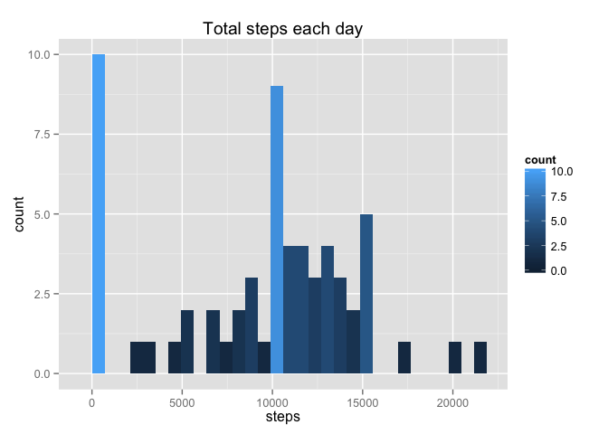
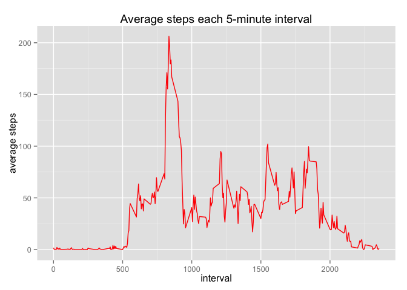
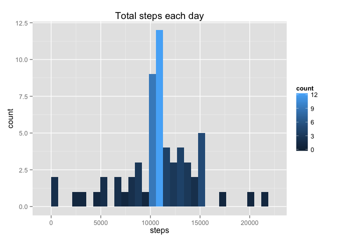
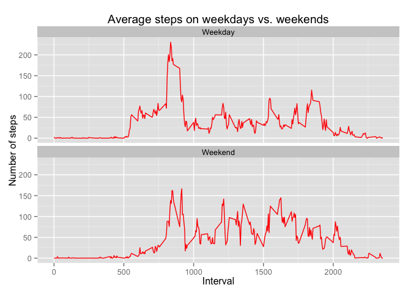

# Reproducible Research: Peer Assessment 1


## Loading and preprocessing the data

I read the activity data file and convert date column to 'Date' type, while steps and interval to 'numeric'


```r
datasteps <- read.csv("activity.csv", header = T, na.strings = "NA")
datasteps$date <- as.Date(datasteps$date)
datasteps$steps <- as.numeric(datasteps$steps)
datasteps$interval <- as.numeric(datasteps$interval)
```

## What is mean total number of steps taken per day?


```r
total.steps <- aggregate(datasteps$steps ~ datasteps$date, FUN = sum, 
                          na.rm = T, na.action = NULL)
colnames(total.steps) <- c("date", "steps")
Total <- sum(total.steps$steps)
```

The total number of steps is 5.70608\times 10^{5}. 


```r
options(warn=-1)
library(ggplot2)
p <- ggplot(total.steps, aes(x = steps))
options(warn=-1)
p <- p + geom_histogram(aes(fill = ..count..)) + ggtitle("Total steps each day")
print(p)
```

```
## stat_bin: binwidth defaulted to range/30. Use 'binwidth = x' to adjust this.
```

 


```r
m <- mean(total.steps$steps)
md <- median(total.steps$steps)
print(m)
```

```
## [1] 9354.23
```

```r
print(md)
```

```
## [1] 10395
```

The mean and median of the total number of steps taken per day are 9354.2295082 and 1.0395\times 10^{4} respectively.

## What is the average daily activity pattern?


```r
options(warn=-1)
interval.steps <- aggregate(datasteps$steps ~ datasteps$interval, FUN = mean, 
                         na.rm = T, na.action = NULL)

colnames(interval.steps) <- c("interval", "av.steps")

library(ggplot2)

p1 <- ggplot(interval.steps, aes(x = interval, y = av.steps))
p1 <- p1 + geom_line(colour = "red") + ggtitle("Average steps each 5-minute interval")
p1 <- p1 + xlab("interval") + ylab("average steps")
print(p1)
```

 

```r
max.interval <- interval.steps[which.max(interval.steps$av.steps), 1]
print(max.interval)
```

```
## [1] 835
```

The 835's 5-minute interval contains the maximum number of steps.

## Imputing missing values


```r
total.na <- sum(is.na(datasteps))
datastepsN <- datasteps
datastepsN$steps[is.na(datastepsN$steps)] <- with(datastepsN, ave(steps, interval, FUN = function(x) mean(x, na.rm = TRUE)))[is.na(datastepsN$steps)]

total.stepsN <- aggregate(datastepsN$steps ~ datastepsN$date, FUN = sum, 
                         na.rm = T, na.action = NULL)

colnames(total.stepsN) <- c("date", "steps")

library(ggplot2)
plt <- ggplot(total.stepsN, aes(x = steps))
plt <- plt + geom_histogram(aes(fill = ..count..)) + ggtitle("Total steps each day")
print(plt)       
```

```
## stat_bin: binwidth defaulted to range/30. Use 'binwidth = x' to adjust this.
```

 

```r
mN <- mean(total.stepsN$steps)
mdN <- median(total.stepsN$steps)
```

The total number of 'NA' value in the dataset is 2304. To fill the missing values I calculate the mean for the corresponding 5-minute interval. The new mean and median values are 1.0766189\times 10^{4} and 1.0766189\times 10^{4} compared to 9354.2295082 and 1.0395\times 10^{4} of the original dataset. So that, the new mean are median are higher than the original.

## Are there differences in activity patterns between weekdays and weekends?


```r
Sys.setlocale("LC_TIME", "en_US.UTF-8")
```

```
## [1] "en_US.UTF-8"
```

```r
datastepsN$days <- as.factor(ifelse(weekdays(datastepsN$date) %in% c("Saturday","Sunday"), "Weekend", "Weekday"))
interval.stepsW <- aggregate(datastepsN$steps ~ datastepsN$interval + datastepsN$days, FUN = mean, 
                            na.rm = T, na.action = NULL)
colnames(interval.stepsW) <- c("interval", "days", "day.steps")
library(ggplot2)

p2 <- ggplot(interval.stepsW, aes(x = interval, y = day.steps))
p2 <- p2 + geom_line(colour = "red") + facet_wrap(~ days, ncol = 1)
p2 <- p2 + ggtitle("Average steps on weekdays vs. weekends")
p2 <- p2 + xlab("Interval") + ylab("Number of steps")
print(p2)
```

 
